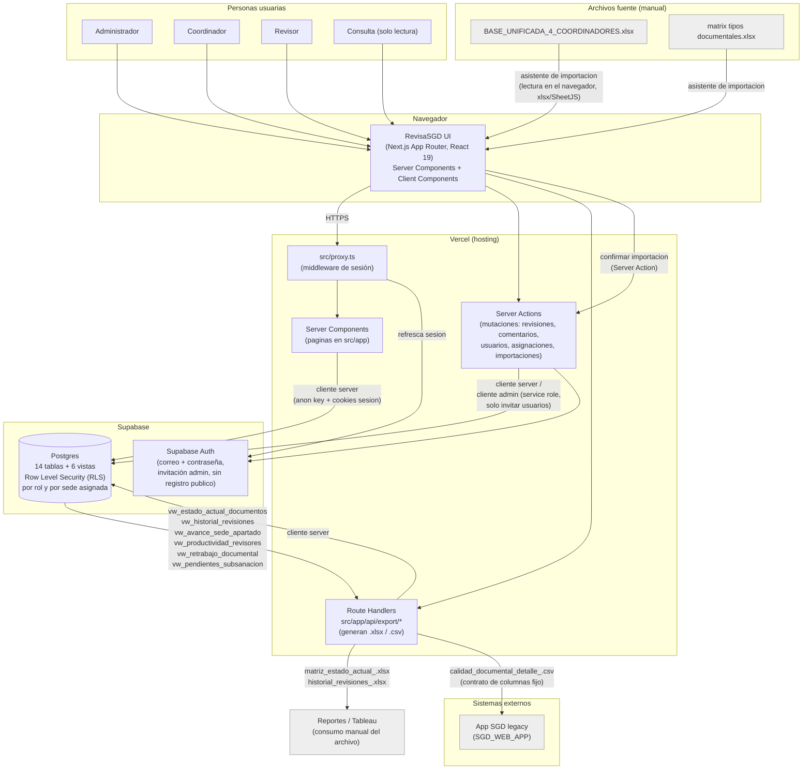

# Diagrama de arquitectura — RevisaSGD

Diagrama basado estrictamente en lo que existe en el código del repositorio: una aplicación Next.js desplegada en Vercel, con Supabase (Postgres + Auth + RLS) como único backend de datos, y un flujo de importación/exportación por archivos Excel/CSV hacia y desde la app SGD legacy. No hay microservicios, colas de mensajes, ni integración con Microsoft Graph/OneDrive implementadas — si el proyecto las contempla como fases futuras, no forman parte de lo construido hoy.

## Notas sobre el diagrama

- **Un solo backend de datos**: no existe una API intermedia propia entre Next.js y Postgres — las páginas y Server Actions hablan directamente con Supabase mediante el SDK de `@supabase/ssr` / `@supabase/supabase-js`, y la autorización real de qué filas puede ver o escribir cada usuario ocurre en Postgres vía RLS, no en una capa de servicio separada.
- **Tres/cuatro formas de cliente Supabase, un solo proyecto Supabase**: `client.ts` (navegador, anon key), `server.ts` (Server Components/Actions, anon key + cookies de sesión), `admin.ts` (service role key, solo para invitar usuarios), y el cliente inline dentro de `src/proxy.ts` (Edge middleware, refresco de sesión). Detalle completo en [`manual-tecnico.md`](./manual-tecnico.md).
- **Importación**: es un flujo manual iniciado por el administrador — no hay ningún trabajo programado (cron, webhook) que traiga los archivos automáticamente. El archivo `.xlsx` se lee **en el navegador** (librería `xlsx`/SheetJS) para mostrar el panel de validación antes de confirmar; solo al confirmar se envían los datos ya parseados al servidor vía Server Action para escribirlos en Postgres.
- **Exportación**: los tres archivos (`.xlsx` × 2, `.csv` × 1) se generan bajo demanda en un Route Handler de Next.js, a partir de las vistas SQL, y se descargan directamente en el navegador de quien las solicita. El CSV de "calidad documental detalle" es el único canal de integración con la app SGD legacy, y es unidireccional (RevisaSGD → SGD, nunca al revés) y manual (alguien debe cargar el archivo en SGD; no hay una API que lo automatice).
- **Despliegue**: el proyecto usa Next.js 16 sobre Vercel (deducido de la presencia de `src/proxy.ts`, convención propia de Next.js 16, y de que el stack — Next.js + Supabase — es el patrón estándar de despliegue en Vercel). No hay en el repositorio workflows de GitHub Actions ni configuración de CI/CD explícita; si el equipo agrega integración continua (lint/build automático en cada push, por ejemplo), ese paso se ubicaría entre el repositorio Git y el build de Vercel, antes del despliegue — pero **no está implementado todavía** en este repositorio.
